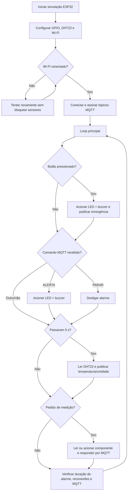

# Fluxograma do funcionamento

```mermaid
flowchart TD
  A[Iniciar simulação ESP32] --> B[Configurar GPIO, DHT22 e Wi-Fi]
  B --> C{Wi-Fi conectado?}
  C -- Não --> C1[Tentar novamente sem bloquear sensores]
  C1 --> C
  C -- Sim --> D[Conectar e assinar tópicos MQTT]
  D --> E[Loop principal]
  E --> F{Botão pressionado?}
  F -- Sim --> G[Acionar LED + buzzer e publicar emergência]
  F -- Não --> H{Comando MQTT recebido?}
  G --> H
  H -- ALERTA --> I[Acionar LED + buzzer]
  H -- PARAR --> J[Desligar alarme]
  H -- Outro/não --> K{Passaram 5 s?}
  I --> K
  J --> K
  K -- Sim --> L[Ler DHT22 e publicar temperatura/umidade]
  K -- Não --> M{Pedido de medição?}
  L --> M
  M -- Sim --> N[Ler ou acionar componente e responder por MQTT]
  M -- Não --> O[Verificar duração do alarme, reconexões e MQTT]
  N --> O
  O --> E
```

O fluxograma é um modelo lógico; as rotinas do firmware real são consultadas em `sketch.ino`.
